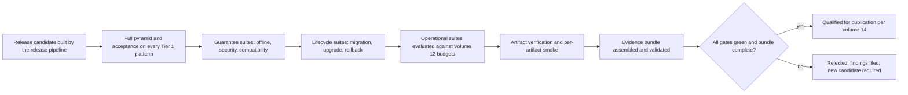

# 04 — Release Qualification and Quality Gates

This chapter defines the quality gates between a change and a published release, and the
qualification pipeline that produces auditable evidence for every release. Gate *composition*
selects suites by type and tier from [chapter 02](02-test-types-catalog.md); this chapter
fixes what each gate blocks, what evidence it leaves, and how waivers work.

## Gate ladder

| Gate | Subject | Blocks | Composition | Evidence |
|---|---|---|---|---|
| Merge gate | Every pull request | Merging | T0 suites (chapter 01 tier table) plus coverage floor (NFR-TEST-003), secret scan, quarantine, classification, and traceability checks | CI check results per PR |
| Trunk gate | Every merge to trunk | Release-branch creation | T1 suites | Trunk reports; distribution report |
| Scheduled lanes | Time-triggered | Nothing directly | T2 lanes | Lane reports; trend series |
| Release qualification | Every release candidate | Publication | T3 pipeline below | Qualification evidence bundle |
| Phase gate | MVP/Beta/v1 exit | Phase progression | T4: T3 plus distribution (FR-TEST-001), mutation thresholds (NFR-TEST-004), requirement coverage (FR-TEST-002), metric audit | Phase-gate audit record |

Gating rules:

1. Gate composition derives from the catalog via FR-TEST-003 classification — CI job lists
   are generated, not hand-curated.
2. A red gate blocks; there is no merge-on-red.
3. Error-catalog consistency: a T0 check verifies in-code error definitions match the
   consolidated specification catalog in both directions (the check ADR-016 assigns to this
   volume).

## Release qualification pipeline

The pipeline runs against candidate artifacts produced by the release pipeline (Volume 14
owns building and publication; this volume owns qualification). Stages execute in order —
cheap early failures prevent expensive later stages — with platform lanes parallel inside a
stage. S1: full gating pyramid plus acceptance on every Tier 1 platform (SM-17). S2: offline
on the full matrix (SM-05), security including SM-16(a) scan gating, compatibility matrix.
S3: migration fixtures (ADR-029), N−1→N upgrade (SM-18), rollback (SM-19, from its phase).
S4: benchmark suite against Volume 12's budgets. S5: published digests for every artifact,
SBOM presence, provenance metadata, signatures and notarization exactly when enabled per the
Volume 1 signing viability note (ADR-013), install/uninstall, per-artifact smoke. S6
assembles and validates the bundle; the decision admits no partial pass.

## Qualification evidence bundle

One JSON document per candidate, assembled at S6, retained with the release record
(retention per Volume 10's storage rules), containing at minimum: candidate identity
(version, commit, artifact digests, toolchain versions); per-gate results (suite, type,
tier, platform, counts, duration, outcome, artifact references); the distribution and
coverage reports; the offline report (isolation layer per platform, sentinel counts); the
performance results against each Volume 12 budget; upgrade/rollback timings against
SM-18/SM-19; artifact verification results; the FR-TEST-002 requirement-coverage summary;
and all waivers. The bundle validates against a versioned JSON Schema (ADR-024); an invalid
or incomplete bundle is itself a qualification failure (E-TEST-005). The bundle digest is
referenced from release provenance (ADR-013) so consumers can audit what qualified their
binary.

## Waiver policy

1. Never waivable: permission-mediation enforcement (SM-16b), the offline guarantee (SM-05),
   secret scanning, artifact checksum verification, migration-refusal semantics (ADR-029).
   These are identity properties; failing them makes a candidate unreleasable.
2. Any other gate may be waived only by a recorded, maintainer-approved waiver entry in the
   bundle naming the failing check, reason, compensating action, and expiry (a date or "next
   release", whichever is sooner). Expired waivers fail S6.
3. Waivers are visible: release notes state them; the bundle carries them permanently.
4. Two consecutive releases waiving the same gate escalate to the change procedure; a third
   consecutive waiver of the same gate is prohibited.

## Requirements

### FR-TEST-009 — Release qualification pipeline and evidence bundle

- Type: Functional
- Status: Approved
- Priority: P0
- Phase: MVP
- Source: Provided
- Owner: Testing and quality (Volume 13)
- Affected components: CI pipelines (Volume 11); release artifacts and Updater (Volume 14); all components under test
- Dependencies: FR-TEST-001..FR-TEST-008; ADR-013, ADR-016, ADR-024, ADR-029
- Related risks: RISK-TEST-006

#### Description

Every release candidate MUST pass the qualification pipeline before publication: stages
S1–S6 in order, full Tier 1 matrix where declared, evidence bundle assembled,
schema-validated, and retained, waiver policy enforced (including the non-waivable list and
the consecutive-waiver escalation). Publication tooling (Volume 14) MUST refuse to publish a
candidate without a valid, complete bundle whose decision is "qualified".

#### Motivation

MVP exit criteria and every SM-bound gate depend on release-time verification having
actually happened; the bundle makes "it passed" a checkable artifact rather than a memory
(Volume 0 audit obligations; SM-17..SM-19).

#### Actors

Release engineers; CI pipelines; maintainers (waiver approvers); auditors.

#### Preconditions

A candidate exists with artifacts on all Tier 1 platforms; suites classified per
FR-TEST-003.

#### Main flow

1. The release pipeline hands artifacts to qualification.
2. S1–S5 execute; results append to the bundle draft.
3. S6 validates the bundle and computes the decision.
4. Volume 14 publication proceeds only on "qualified".

#### Alternative flows

- A permitted waiver is recorded per policy and S6 re-evaluates; non-waivable failures
  terminate qualification as rejected.
- Hotfix releases run the same pipeline — urgency is handled by parallelizing lanes, never
  by skipping them.

#### Edge cases

- First release: the upgrade stage records "not applicable — first release" explicitly,
  never a vacuous pass. Rollback pre-Beta records "not applicable — pre-phase".
- An unavailable Tier 1 platform lane means qualification cannot complete; platform absence
  is not waivable for Tier 1.

#### Inputs

Candidate artifacts, suite results, Volume 12 budgets, waiver decisions.

#### Outputs

The evidence bundle; a qualified/rejected decision; findings for rejections.

#### States

Qualification is the gate between the Release machine's `candidate` and `published` states
(Volume 2); state semantics remain Volume 14's.

#### Errors

E-TEST-005 (bundle incomplete/invalid), E-TEST-006 (gate evaluation failure); suite failures
carry their own identities.

#### Constraints

Stage order fixed; no publication path may bypass the bundle check (enforced in the
Volume 14 release pipeline definition).

#### Security

The non-waivable list pins security identity properties; the bundle is tamper-evident via
its digest in release provenance (ADR-013).

#### Observability

Stages emit `test.gate.evaluated`; completion emits `test.qualification.completed` with the
bundle digest; all events use the Volume 10 envelope.

#### Performance

Wall-clock is dominated by S1; lanes parallelize per chapter 03. Release-cadence targets
belong to Volume 15.

#### Compatibility

The bundle schema is versioned; consumers read any version within a major line (ADR-015
discipline applies from v1).

#### Acceptance criteria

- Given a candidate passing all stages, when S6 completes, then a schema-valid bundle
  exists, the decision is "qualified", and publication proceeds.
- Permission case: given a candidate failing SM-16b enforcement, when a waiver is attempted,
  then it is refused (non-waivable) and the candidate is rejected.
- Negative case: given publication tooling invoked without a valid bundle, when it runs,
  then it refuses with E-TEST-005 and exit code 9.
- Error case: given gate measurement infrastructure failing mid-run, when S6 evaluates, then
  the gate counts as unmeasured — never passed — and the candidate is not qualified.
- Negative case: given a bundle with an unapproved waiver, when validated, then validation
  fails.
- Observability case: every stage's `test.gate.evaluated` event correlates to the candidate,
  and the provenance bundle digest matches the retained bundle.

#### Verification method

Pipeline self-tests with synthetic candidates (passing, failing, waived,
non-waivable-failing); bundle schema validation tests; T4 audit comparing published releases
to retained bundles.

#### Traceability

SM-05, SM-14, SM-16, SM-17, SM-18, SM-19; MVP exit criteria (Volume 1, chapter 05); ADR-013;
Volume 14 release pipeline (by name); NFR-TEST-006.

### NFR-TEST-006 — Qualification completeness

- Category: Compliance
- Priority: P0
- Phase: MVP
- Metric: (a) Fraction of published releases with a retained, schema-valid bundle whose decision is "qualified"; (b) fraction of bundle-listed gates actually executed (no unmeasured gate counted as passed); (c) waiver-policy violations
- Target: (a) 100%; (b) 100%; (c) 0
- Minimum threshold: Same as target — one violation is a release-process incident
- Measurement method: Automated audit comparing published releases to retained bundles, re-validating schemas and waiver rules; post-publication and at T4
- Test environment: CI audit job over release records
- Measurement frequency: Every release; audited at phase gates
- Owner: Testing and quality (Volume 13)
- Dependencies: FR-TEST-009
- Risks: RISK-TEST-006
- Acceptance criteria: Zero discrepancies for every published release; any discrepancy opens a P0 incident and blocks further releases until resolved.

## Errors

### E-TEST-005 — Qualification evidence incomplete

- Code: E-TEST-005
- Category: Release qualification
- Severity: Critical
- User message: "Release qualification evidence is missing or invalid; the candidate cannot be published."
- Technical message: Evidence bundle for candidate `<version>@<commit>` failed validation: `<schema error | missing gate results | unapproved or expired waiver>`.
- Cause: A stage skipped or crashed without recording results; bundle assembly defect; waiver-policy violation.
- Safe context data: Candidate version and commit, failing bundle fields, schema version.
- Recoverability: Recoverable by re-running missing stages or fixing bundle tooling — never by editing results.
- Retry policy: Re-run qualification stages; no automatic retry of publication.
- Recommended action: Re-execute incomplete stages; if tooling is at fault, fix and re-qualify the same artifacts.
- Exit code: 9 (integrity error).
- HTTP mapping: Not applicable.
- Telemetry event: `test.evidence.rejected`
- Security implications: Blocking publication on missing evidence prevents unverified artifacts from shipping; this error firing in publication tooling is the control working.

### E-TEST-006 — Gate evaluation failure

- Code: E-TEST-006
- Category: Test infrastructure
- Severity: Error
- User message: "A quality gate could not be evaluated."
- Technical message: Gate `<gate>` evaluation failed in `<report generation | scanner | measurement infrastructure>`: `<detail>`; result recorded as 'unmeasured'.
- Cause: Evaluator malfunction or missing input artifact — distinct from a gate that ran and failed.
- Safe context data: Gate identifier, failing component, input artifact references.
- Recoverability: Recoverable by fixing the evaluator and re-running.
- Retry policy: One automatic re-run permitted (evaluation is read-only over recorded results); persistent failure escalates.
- Recommended action: Treat as unmeasured, never as passed (Volume 1 metric governance); fix and re-run.
- Exit code: 1 (general error).
- HTTP mapping: Not applicable.
- Telemetry event: `test.gate.errored`
- Security implications: Fail-closed semantics prevent an evaluator outage from becoming a bypass.

## Events

Test and qualification tooling emit the following events using the Volume 10 event envelope
(version, producer, correlation IDs, timestamp, ordering, delivery, persistence, retention,
privacy, redaction, compatibility, failure behavior — the envelope's fields are referenced,
not restated). Payloads carry no secret material by construction (FR-TEST-008).

| Event | Emitted when | Payload (summary) |
|---|---|---|
| `test.suite.completed` | A classified suite finishes in any tier | Suite id, type, tier, platform, counts by outcome, duration, report references |
| `test.gate.evaluated` | A gate computes a result (pass/fail/unmeasured) | Gate id, subject, result, evidence references |
| `test.qualification.completed` | S6 finishes for a candidate | Candidate identity, decision, bundle digest, waiver count |
| `test.flake.quarantined` | A quarantine change lands (ADR-177) | Test identifier, issue link, quarantined date |
| `test.fixture.failed` | E-TEST-001 raised | Fixture path, digests |
| `test.replay.diverged` | E-TEST-002 raised | Cassette name, frame index |
| `test.scenario.rejected` | E-TEST-003 raised | Script name, offending directive |
| `test.hermeticity.violated` | E-TEST-004 raised | Destination, test identifier, isolation layer |
| `test.evidence.rejected` | E-TEST-005 raised | Candidate identity, failing fields |
| `test.gate.errored` | E-TEST-006 raised | Gate id, failing component |

## Risks

### RISK-TEST-006 — Gate erosion under release pressure

- Category: Process
- Probability: Medium
- Impact: High
- Severity: High
- Mitigation: Non-waivable list for identity properties; waiver policy with expiry, visibility, and consecutive-waiver escalation; publication tooling refusing unbundled candidates (FR-TEST-009); NFR-TEST-006 post-publication audit with P0 incident semantics
- Detection: Waiver counts and repeats in bundles; NFR-TEST-006 audit discrepancies; phase-gate waiver-history review
- Owner: Testing and quality (Volume 13)
- Status: Open

Deadlines make skipping "just this once" locally rational and globally corrosive. The
response is structural: publication cannot mechanically proceed without evidence, exceptions
are few, loud, and expiring, and repetition escalates to a specification change rather than
quiet normalization.
