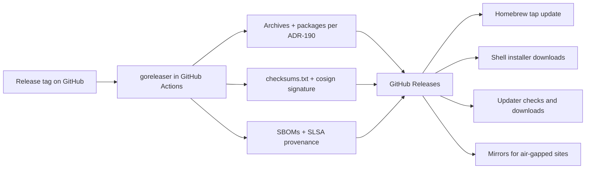

# 01 — Distribution Channels

This chapter specifies how Andromeda releases reach machines: the release pipeline (keystone
FR-REL-001), the artifact inventory and its integrity metadata (checksums, signatures, SBOM,
provenance — FR-REL-002), the installation channels (Homebrew tap, shell installer, Linux
packages — FR-REL-003), and air-gapped installation with offline update sources
(FR-REL-004). Tooling decisions are fixed by ADR-013; the artifact grammar by ADR-190;
channel semantics by ADR-191. The Release entity and its frozen states are Volume 2's; the
full Release state machine is chapter [05](05-state-machines.md).

## Pipeline overview

Components and relations: a release tag (Volume 11 tag conventions) is the only trigger; the
pinned goreleaser pipeline (ADR-013) builds the per-platform archives and Linux packages,
computes the SHA-256 checksums file, signs it with cosign keyless signatures, and generates
per-archive SPDX SBOMs plus a SLSA provenance attestation. GitHub Releases is the canonical
publication point; the Homebrew tap, the shell installer, the Updater (chapter
[02](02-updater-and-rollback.md)), and air-gapped mirrors all consume it. Constraints: no
artifact is ever built or published outside this pipeline (ADR-013 rule 1); every downstream
channel serves byte-identical artifacts from the canonical set; a release is complete only
when the full ADR-190 inventory exists.

## Artifact inventory

Per release, following the ADR-190 grammar (`<v>` = version without `v` prefix):

| Artifact | Contents | Phase |
|---|---|---|
| `andromeda_<v>_darwin_arm64.tar.gz` | Binary, `LICENSE`, third-party notices | MVP |
| `andromeda_<v>_linux_x86_64.tar.gz` / `..._linux_arm64.tar.gz` | Same layout | MVP |
| `andromeda_<v>_linux_<arch>.deb` / `.rpm` / `.apk` | nfpm-built package files | MVP |
| `andromeda_<v>_checksums.txt` (+ `.sig`, `.pem`) | SHA-256 lines; cosign keyless signature | MVP |
| `<archive>.sbom.spdx.json` | SPDX JSON SBOM per archive (syft) | MVP |
| Provenance attestation (in-toto) | SLSA provenance binding artifacts to workflow and revision | MVP |
| `andromeda_<v>_darwin_x86_64.tar.gz`, `..._darwin_universal.tar.gz` | macOS Intel and universal binary — PENDING VALIDATION (register entry V14-OQ-2) | MVP when viable |

macOS Developer ID signing and notarization remain PENDING VALIDATION per ADR-013 (register
entry V14-OQ-1); until resolved, macOS artifacts ship with cosign verification plus
documented Gatekeeper guidance, and every release's notes state the signing status (Volume 1
signing viability note).

## Requirements

### FR-REL-001 — Release pipeline and distribution channels

- Type: Functional
- Status: Approved
- Priority: P0
- Phase: MVP
- Source: Provided
- Owner: Updater / release engineering (Volume 14)
- Affected components: Updater, Package Manager, CLI
- Dependencies: ADR-004, ADR-013, ADR-015, ADR-190, ADR-191; Volume 11 CI pipelines
- Related risks: RISK-REL-002

#### Description

Every Andromeda release MUST be produced by the ADR-013 pipeline, triggered exclusively by a
release tag, and published to GitHub Releases as the canonical origin with the complete
ADR-190 artifact inventory. Publication MUST populate exactly one ADR-191 channel (`stable`,
`rc`, `beta`, or `nightly`), derived from the version's SemVer pre-release identifier, and
MUST update every distribution channel bound to that channel (Homebrew tap for `stable`;
Updater metadata for all). One tag MUST deterministically yield the complete inventory or
fail as a whole — partial releases MUST NOT be published.

#### Motivation

Releases are the trust boundary with every user (ADR-013). A single, tag-triggered,
inventory-complete pipeline makes "what is release X" a checkable fact rather than a
convention, and is the precondition for MVP items 22, 23, and 27.

#### Actors

Release engineers (tagging); the CI pipeline; the Updater and installers as consumers.

#### Preconditions

Volume 11 CI exists and is green for the tagged revision; Volume 13 release-qualification
gates have passed for the channel being published.

#### Main flow

1. A maintainer pushes a release tag per Volume 11 conventions.
2. The pipeline builds the platform matrix, packages, checksums, signs, and attests per
   ADR-013/ADR-190.
3. The pipeline publishes the GitHub Release (state `candidate` for pre-release channels,
   `published` for `stable` — chapter 05) and updates the Homebrew tap for `stable`.
4. The release-audit job verifies the inventory against the ADR-190 grammar and the
   channel-to-version mapping against ADR-191.

#### Alternative flows

- Nightly channel: a scheduled workflow tags and publishes a `nightly` snapshot from trunk
  when trunk changed since the previous snapshot; identical inventory rules apply.
- Re-release after a failed pipeline: a fixed release is a **new** version (INV-REL-01);
  the failed tag's partial output is discarded, never patched in place.

#### Edge cases

- A tag on a revision that fails qualification gates produces no release; the tag is
  recorded as consumed (versions are never reused, ADR-015).
- Yanking (chapter 05) removes a release from offers, not from history; artifacts remain
  downloadable for audit unless legal reasons force removal, which the yank reason records.

#### Inputs

Release tag; pinned pipeline configuration; qualification gate results.

#### Outputs

GitHub Release with the full inventory; tap update; Release rows learnable by every
installation's Updater.

#### States

Release machine states (`drafted` → `candidate`/`published`, chapter 05).

#### Errors

Pipeline failures are CI failures (Volume 11), not runtime E-codes; consumer-side failures
use the E-REL catalog (chapter 02).

#### Constraints

No artifacts from developer machines (ADR-013); versions and file names are immutable once
published; the artifact grammar changes only by superseding ADR-190.

#### Security

Keyless signing binds artifacts to the repository's CI identity; the release workflow runs
with minimal, environment-protected permissions (Volume 11); fork PRs never reach release
credentials.

#### Observability

Each installation records learned releases (`release.metadata.refreshed` event, chapter 02);
the pipeline's provenance attestation makes the build auditable end-to-end.

#### Performance

Pipeline duration is a CI concern (Volume 11); no runtime budget attaches here.

#### Compatibility

Artifact grammar and channel enum are public contracts under NFR-REL-003; additive matrix
growth (new platforms) is a minor change.

#### Acceptance criteria

- Given a release tag on a green revision, when the pipeline completes, then the GitHub
  Release contains exactly the ADR-190 inventory for the platform matrix and the
  release-audit job passes.
- Given any artifact in the release, when its SHA-256 is computed, then it matches the
  signed checksums file.
- Given a `stable` publication, when the tap is inspected, then it references the new
  version and its checksums.
- Negative case: given a pipeline step failure after some artifacts uploaded, when the run
  ends, then no Release is published on any channel and the partial upload is discarded.
- Permission case: given a contributor without release permissions, when they push a tag,
  then the protected release workflow refuses to run (Volume 11 branch/tag protection).

#### Verification method

Release-audit CI job (inventory + grammar + channel mapping); Volume 13 release
qualification suite; manual verification commands documented per release (FR-REL-002).

#### Traceability

PRD-013; MVP items 22/23/27; ADR-013, ADR-190, ADR-191; SM-20 (audit vehicle); chapter 05
Release machine.

### FR-REL-002 — Integrity metadata: checksums, signatures, SBOM, provenance

- Type: Functional
- Status: Approved
- Priority: P0
- Phase: MVP
- Source: Provided
- Owner: Updater / release engineering (Volume 14)
- Affected components: Updater, Package Manager, CLI
- Dependencies: ADR-013, ADR-190; FR-REL-001
- Related risks: RISK-REL-002

#### Description

Every release MUST publish: a SHA-256 checksums file covering every artifact; a cosign
keyless signature of that checksums file; one SPDX JSON SBOM per archive; and a SLSA
provenance attestation. Checksum verification is unconditional for every programmatic
consumer (Updater, installer). Signature verification follows `[update].signature_policy`
(chapter 02): `when_present` verifies whenever signature material exists for the release and
refuses on mismatch; `required` additionally refuses when material is absent. Human
verification commands (checksum and cosign) MUST be documented in every release's notes.

#### Motivation

The verification chain (digest → signature → provenance → SBOM) is what makes every other
distribution promise checkable; it operationalizes ADR-002 license policy and ADR-013
supply-chain posture at the point of download.

#### Actors

The pipeline (producer); Updater, shell installer, mirrors, humans, downstream packagers
(verifiers).

#### Preconditions

FR-REL-001 published the release; the verifier has the artifact plus the checksums file.

#### Main flow

1. Verifier fetches artifact and checksums file (and signature material when verifying
   signatures).
2. Signature of the checksums file is verified against the expected CI identity.
3. The artifact digest is compared to its checksums line; on match, the artifact is
   accepted.

#### Alternative flows

- Signature material absent under `when_present`: checksum-only verification proceeds and
  the result explicitly records `signature: absent` (never silently equal to verified).
- Air-gapped verification: all inputs are local files (FR-REL-004); no network step exists.

#### Edge cases

- A release published before signing viability resolves (Volume 1 note) verifies as
  `signature: absent` even under later-installed versions; policy `required` refuses it
  with E-REL-004 guidance naming the policy.
- SBOM or provenance absence does not block artifact installation but fails the release
  audit — the *release* is defective, not the verifier.

#### Inputs

Artifacts, checksums file, signature bundle, attestations; verifier policy.

#### Outputs

A verification report (per UpdaterPort `Verify`): per-artifact digest result, signature
status, provenance status.

#### States

Update machine `verifying` state (chapter 05) when performed by the Updater.

#### Errors

E-REL-004 (verification failed); E-REL-002 (metadata malformed).

#### Constraints

SHA-256 is the digest algorithm (INV-REL-02); algorithm changes are a superseding ADR plus
dual-publication transition (ADR-190 reversal plan).

#### Security

A failed verification MUST abort the operation, preserve the offending files for
inspection, emit `update.verification.failed`, and produce an Audit Record; the Updater
MUST NOT offer a retry that skips verification.

#### Observability

`update.artifact.verified` / `update.verification.failed` events with digest and policy
fields (chapter 02); verification results persist in update history.

#### Performance

Verification is included in the SM-18 update budget (NFR-REL-001); digesting is I/O-bound
and imposes no separate target.

#### Compatibility

Verification data formats (checksums layout, signature bundle, SPDX, in-toto) are part of
the ADR-190 public grammar.

#### Acceptance criteria

- Given a pristine release, when the Updater verifies it, then all digests match, signature
  status reflects the release's signing state, and the report is persisted.
- Given one flipped byte in any artifact, when verification runs, then it fails with
  E-REL-004, nothing is applied, and the audit record exists.
- Given `signature_policy = "required"` and an unsigned release, when verification runs,
  then it refuses with E-REL-004 naming the policy, even though checksums match.
- Observability case: given any verification, when events are inspected, then exactly one
  terminal verification event exists with the correlation ID of the update process.

#### Verification method

Volume 13 tamper-fixture suite (bit flips, truncation, wrong-identity signatures);
release-audit job re-verifying published releases; SM-18 harness includes verification.

#### Traceability

INV-REL-02; ADR-013, ADR-190; FR-REL-006; E-REL-004; SM-16 supply-chain posture.

### FR-REL-003 — Installation channels: Homebrew tap, shell installer, Linux packages

- Type: Functional
- Status: Approved
- Priority: P1
- Phase: MVP
- Source: Provided
- Owner: Updater / release engineering (Volume 14)
- Affected components: Package Manager, Updater, CLI
- Dependencies: FR-REL-001, FR-REL-002; ADR-190; FR-PORT-003 (path resolution)
- Related risks: RISK-REL-002

#### Description

Andromeda MUST be installable on macOS and Linux through, at minimum: (a) the
`homebrew-andromeda` tap (ADR-013), serving `stable` releases; (b) a POSIX-sh shell
installer (`install.sh`), published in the repository at a stable documented URL and
attached to each release, which detects `<os>_<arch>` via `uname`, downloads from the
canonical origin, always verifies checksums (and signatures when a cosign executable is
available, reporting `signature: skipped` otherwise), installs to `~/.local/bin` by default
(`--bin-dir` to override), and never requires elevated privileges for the default path; and
(c) the Linux `.deb`/`.rpm`/`.apk` package files attached to each release. Manual
installation (download archive, verify, place binary) MUST be documented with exact
commands. All channels MUST deliver byte-identical binaries from the canonical origin.

#### Motivation

MVP item 22 requires documented install paths on both Tier 1 operating systems; multiple
channels serve different environments (workstations, containers, minimal images) without
multiplying build outputs.

#### Actors

End users; fleet provisioning scripts; the tap and packaging automation.

#### Preconditions

A published release exists on the requested channel; the target platform is in the ADR-190
matrix.

#### Main flow

1. The user runs one documented channel (brew, installer script, package file, or manual
   steps).
2. The channel fetches and verifies artifacts per FR-REL-002.
3. The binary lands on `PATH` (or the channel prints exact `PATH` guidance); the
   installation method is detectable afterwards (FR-REL-009).

#### Alternative flows

- `install.sh --version <v>` installs a pinned version; `--channel <name>` selects the
  newest release of a channel (ADR-191 offer rule).
- Container images are OUT OF SCOPE for this requirement (no containerized channel is
  committed; ADR-013 notes ko as revisitable).

#### Edge cases

- Unsupported `<os>_<arch>` (e.g., `darwin_x86_64` before V14-OQ-2 resolves): the installer
  exits with a message naming the supported matrix and the pending status — it MUST NOT
  fall back to a wrong architecture (Rosetta guidance is documentation, not silent
  behavior).
- Checksum failure in the installer aborts before any file is placed and preserves the
  downloaded files for inspection, mirroring E-REL-004 semantics.

#### Inputs

Channel invocation with optional version/channel/bin-dir arguments.

#### Outputs

Installed `andromeda` binary; installer transcript stating version, verification results,
and install location.

#### States

None (installation precedes any Andromeda process state).

#### Errors

Installer failures are script exit codes with messages mirroring the E-REL catalog's
guidance; package-manager failures surface through the manager.

#### Constraints

The installer is POSIX sh (no bash-isms), pinned per release, and idempotent (re-running
with the same arguments converges to the same result).

#### Security

The documented installer invocation uses HTTPS to the canonical origin; the installer never
pipes further scripts, never elevates by default, and prints every URL it fetches. Package
files carry checksums verifiable per FR-REL-002 before installation.

#### Observability

Installation is pre-runtime: observability is the installer transcript. First run records
installation metadata (FR-REL-009) into normal observability.

#### Performance

Installer end-to-end time is dominated by download; no separate budget beyond the reference
network expectations of Volume 1.

#### Compatibility

`install.sh` flags and defaults are a public contract (SM-20 list applies to distribution
surfaces via NFR-REL-003); tap formula name `andromeda` is stable.

#### Acceptance criteria

- Given a clean Tier 1 machine, when each documented channel is exercised, then `andromeda
  version` succeeds and reports the expected version (automated per release, per platform).
- Given a tampered archive on a mirror, when `install.sh` verifies it, then installation
  aborts with a non-zero exit and no binary is placed.
- Given `install.sh` without cosign on `PATH`, when it completes, then the transcript
  states `signature: skipped` explicitly.
- Negative case: given an unsupported architecture, when the installer runs, then it exits
  with the supported-matrix message and creates nothing.
- Compatibility case: given the previous release's documented commands, when run against
  the new release, then they still function (grammar stability).

#### Verification method

Per-release installation matrix in CI (tap, installer, package files, manual steps) on Tier
1 platforms; tamper fixtures for the installer; SM-17 acceptance-suite gating.

#### Traceability

MVP item 22; PRD-011; ADR-013, ADR-190; FR-REL-002, FR-REL-009.

### FR-REL-004 — Air-gapped installation and offline update sources

- Type: Functional
- Status: Approved
- Priority: P1
- Phase: MVP
- Source: Provided
- Owner: Updater (Volume 14)
- Affected components: Updater, Package Manager, Configuration Manager
- Dependencies: FR-REL-002, FR-REL-005; ADR-190, ADR-191; `[update].source` (chapter 02)
- Related risks: RISK-REL-002

#### Description

Andromeda MUST be installable and updatable without Internet access on the target machine.
(a) **Air-gapped installation** (MVP): the documented procedure downloads the ADR-190
artifact set on a connected machine, transfers it, verifies checksums (and signatures, when
verification tooling is available inside the enclave) locally, and installs manually or via
`install.sh` pointed at the local files. (b) **Offline update source** (Beta): a **release
mirror** — a filesystem directory or internal HTTPS root containing an `index.json`
(schema owned by this volume: an array of release entries with `version`, `channel`,
`published_at`, `min_upgrade_from`, `yanked`, and per-artifact `platform`/`name`/`size`/
`sha256`) plus the referenced artifact and metadata files. Setting `[update].source` to a
mirror root makes the full chapter 02 update flow, including verification, operate against
it with no other configuration change.

#### Motivation

Local-first is a product identity property (PRD-003); enterprises with isolated networks
are an explicit audience (PRD-013). Update behavior must not silently assume the public
Internet.

#### Actors

Enclave administrators (building mirrors); users inside air-gapped environments; the
Updater.

#### Preconditions

A connected machine can fetch the canonical release; a transfer path into the enclave
exists.

#### Main flow

1. Administrator fetches the artifact set and metadata for chosen releases, builds the
   mirror layout (documented procedure), and transfers it.
2. Enclave installations set `[update].source` to the mirror root.
3. `andromeda update check` and the full update flow operate against the mirror, verifying
   per FR-REL-002 with local files.

#### Alternative flows

- One-off air-gapped upgrade without a mirror: transfer a single release's artifacts and
  run the documented manual replacement procedure; rollback retention (FR-REL-008) still
  applies because retention happens at apply time, not download time.

#### Edge cases

- Stale mirrors: a mirror that omits a `yanked` marking cannot be detected inside the
  enclave; the mirror-build procedure therefore MUST re-fetch yank status at build time and
  the update history records the source used (audit trail).
- A mirror serving a release older than the installed version triggers the ADR-191
  no-downgrade rule: the check reports `up_to_date`.

#### Inputs

Mirror root path/URL; mirror `index.json`; artifact files.

#### Outputs

Identical update outcomes as the canonical source, with `source` recorded in update
history.

#### States

Update machine states, unchanged (chapter 05).

#### Errors

E-REL-002 (malformed `index.json`); E-REL-001 (unreachable mirror); E-REL-004
(verification failure) — all defined in chapter 02.

#### Constraints

The mirror layout and `index.json` schema are a public contract versioned with the config
schema (Volume 10 `schema_version` discipline referenced, not restated).

#### Security

Mirrors are untrusted storage: verification inside the enclave uses the same digest chain
as the canonical path; signature verification against the CI identity works offline when
signature material and verification tooling are present in the enclave (the trust-root
provisioning procedure is documented; its tooling choice is V14-OQ-3, PENDING VALIDATION).

#### Observability

Update events carry the source kind (`github` | `mirror`); update history rows record the
mirror root.

#### Performance

Mirror updates exclude network transfer from SM-18's ≤ 10 s non-transfer budget the same
way the canonical path does (NFR-REL-001).

#### Compatibility

`index.json` evolves additively; readers reject unknown newer `schema_version` values
rather than guess (Volume 2 chapter 10 discipline).

#### Acceptance criteria

- Given a mirror built by the documented procedure and OS-level network disablement, when
  the full update flow runs against it, then it completes with verification passed and
  history recording the mirror source.
- Given a mirror with a tampered artifact, when the update runs, then it fails in
  `verifying` with E-REL-004 and the installed version is unchanged.
- Given a mirror `index.json` with an unknown newer schema version, when checked, then the
  check fails with E-REL-002 naming both versions.
- Negative case: given `[update].source` pointing at a nonexistent path, when `update
  check` runs, then E-REL-001 is reported cleanly offline (no hang, no partial state).

#### Verification method

Volume 13 offline suite: mirror fixtures under OS-level network disablement, tamper and
schema-skew fixtures; documented-procedure walkthrough in CI.

#### Traceability

PRD-003, PRD-013; SM-05 (offline posture), SM-18; ADR-190, ADR-191; FR-REL-005/006;
`[update].source` key (chapter 02).

## Risks

### RISK-REL-002 — External signing and notarization dependencies

- Category: Supply chain / external dependency
- Probability: Medium
- Impact: Medium
- Severity: Medium
- Mitigation: signature policy is configuration, not architecture (ADR-013 reversal plan): checksums are unconditional and self-contained; `when_present` default keeps releases consumable if Sigstore infrastructure or the Apple Developer decision (V14-OQ-1) stalls; dual-publish transitions for any format change (ADR-190)
- Detection: release-audit job verifies every published release's signature material; CI verification tests against the pinned cosign major (ADR-013); update-check telemetry on verification failures under consent
- Owner: Release engineering (Volume 14)
- Status: Open

The verification chain leans on third parties: Sigstore's keyless infrastructure, GitHub's
OIDC identity, and — unresolved — Apple's notarization program. Any of them changing
behavior degrades signature verification, not integrity: the SHA-256 chain and provenance
remain valid, and the policy knob (`signature_policy`) plus documented Gatekeeper guidance
bound the blast radius while a superseding decision lands.
