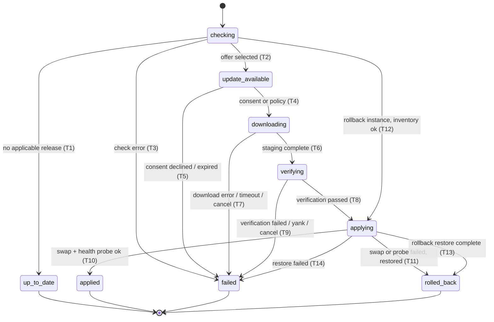
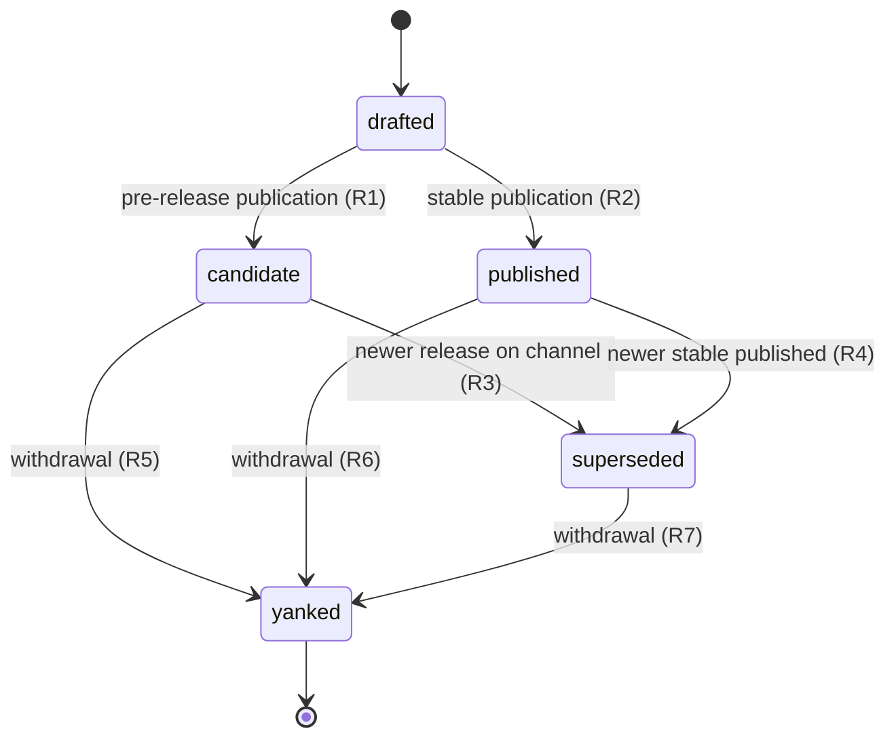

# 05 — State Machines: Update and Release

This chapter defines the two full machines Volume 14 owns per Volume 2 chapter 09: the
**Update process** (frozen states: `checking`, `up_to_date`, `update_available`,
`downloading`, `verifying`, `applying`, `applied`, `failed`, `rolled_back`) and the
**Release** catalog entity (frozen states: `drafted`, `candidate`, `published`,
`superseded`, `yanked`). Both machines use exactly the frozen names and define all twelve
mandatory elements (Volume 0 chapter 02). FR-REL-016 binds conformance and the update
history that persists every Update instance.

## Update process machine

One instance per update-shaped operation: an explicit `andromeda update` run, an `update
check`, a scheduled check, an automated apply (FR-REL-007), or a rollback (FR-REL-008).
Instances persist in the global database's **update history**.

The diagram's components are the nine frozen states; its relations are transitions T1–T14;
its constraints: `applying` is unreachable without a passed `verifying` for the same
artifact set (except rollback instances, whose T12 guard re-verifies the retained
artifact's recorded checksum instead); no transition leaves a terminal state; and
`update_available` is the machine's only resting state — an instance may legitimately
remain there awaiting consent indefinitely (defined here; consistent with Volume 2, which
marks it non-terminal).

The twelve elements:

1. **Initial state:** `checking`.
2. **Terminal states:** `up_to_date`, `applied`, `failed`, `rolled_back`.
3. **Transitions:** T1–T14 above. Check-only instances end at T1/T3 or rest at
   `update_available`; full updates continue T4–T11; rollback instances take T12 then
   T13/T14, where `checking` consults only the local retention inventory (offline,
   FR-REL-008).
4. **Events:** every transition emits `update.state.changed`; T1/T2 additionally
   `update.check.completed`, T3 `update.check.failed`, T6 `update.artifact.downloaded`
   (per artifact) , T8 `update.artifact.verified`, T9 `update.verification.failed`, T10
   `update.version.applied`, T11/T13 `update.version.rolled_back`, T5/T7/T14
   `update.process.failed`.
5. **Guards:** T2 — ADR-191 offer rule plus upgrade-path guard (E-REL-009) and yank
   exclusion (INV-REL-03); T4 — recorded consent (interactive, `--yes`, or
   `always_allow_policy` for `system_modification`), update lock acquired (E-REL-007),
   ownership is `self` (E-REL-008), disk preflight (E-REL-010); T8 — FR-REL-002
   verification per `signature_policy`; T9 — includes yank re-evaluation (E-REL-011);
   T10 — atomic swap succeeded and the health probe of the new binary passed; T12 —
   retained version exists, checksum re-verified, schema-pairing confirmation obtained
   when required (ADR-192).
6. **Side effects:** refreshing local Release rows (`checking`); staging files in the
   cache directory (`downloading`); persisted verification report (`verifying`); retention
   of the current binary, atomic swap, health probe, Audit Records (`applying`); notice
   emission per `[update].notify`.
7. **Persistence:** one update-history row per instance (ULID, kind: check/update/
   rollback/automated, source, channel, versions, per-state timestamps, outcome, error
   code, consent reference, verification report reference, ownership evidence,
   schema-pairing outcome). The row is appended at instance creation and updated at every
   transition, transactionally with the transition's event record.
8. **Recovery:** on process start, a recovery pass reclaims stale update locks (holder
   dead) and marks history rows whose instance died in a non-terminal state as `failed`
   with recorded reason `interrupted` (the Update enum has no `interrupted` state; the
   *reason* carries it — defined here, honoring PRD-010's never-assume-complete rule). A
   death inside `applying` is resolved by inspecting the PAL swap outcome: the binary is
   old (mark `failed`) or new (run the health probe; mark `applied` or restore per T11).
   Staged downloads survive for resume.
9. **Timeouts:** `[update.timeouts]` bounds `checking` (`check_seconds`), `downloading`
   (`download_seconds`), and `applying` (`apply_seconds`); expiry takes the state's
   failure transition with E-REL-012. `verifying` is bounded by `apply_seconds` as its
   preparation budget. `update_available` has no timeout (resting).
10. **Cancellation:** user interrupt or shutdown before `applying` takes the current
    state's failure transition with E-REL-012 (exit code 8 at the CLI); inside `applying`,
    the swap is a short non-interruptible critical section (FR-ARCH-004): cancellation
    before the swap point aborts to `failed`; after it, the instance completes T10/T11.
11. **Retries:** downloads retry per E-REL-003 (≤ 3 resume attempts with backoff); no
    automatic retries for check (next interval), verification (never), or apply (never);
    automated instances additionally obey FR-REL-007's three-strikes suspension.
12. **Errors:** E-REL-001/002 (T3), E-REL-003/010/012 (T7), E-REL-004/011/012 (T9),
    E-REL-005 (T11 context), E-REL-006 (T12 refusal / T14), E-REL-007/008/009 (guard
    refusals recorded on the instance).

## Release machine

Release rows are published facts (INV-REL-04): the pipeline (FR-REL-001) is the
authoritative writer of state changes, and each installation's local rows mirror what its
update source reports (`release.metadata.refreshed`). Locally, most rows are first seen
already `candidate` or `published`; `drafted` exists for the pipeline's own records.

The diagram's components are the five frozen states; relations R1–R7; constraints: state
only ever advances (no un-yank, no un-publish — a corrected release is a new version per
INV-REL-01); `published` and `superseded` are resting states (installable per policy);
`yanked` is the only terminal state and is never offered by checks (INV-REL-03).

The twelve elements:

1. **Initial state:** `drafted` (assembled by the pipeline, not public).
2. **Terminal states:** `yanked`. (`published`/`superseded` are resting: rows persist
   indefinitely as installable/audit facts; `candidate` rests until superseded or yanked;
   abandoned drafts are deleted by the pipeline, which is row removal, not a transition.)
3. **Transitions:** R1–R7. Channel maturity decides R1 vs R2 (`stable` → `published`;
   `rc`/`beta`/`nightly` → `candidate`).
4. **Events:** locally, `release.metadata.refreshed` on any mirror-in of rows and
   `release.yank.detected` when a yank affecting the installed or targeted version is
   learned; pipeline-side publication announcements are release notes and GitHub Releases
   records (Volume 11 CI observability), not runtime events.
5. **Guards:** R1/R2 — complete ADR-190 inventory, passed Volume 13 qualification gates
   for the channel, FR-REL-015 notes present (release audit blocks otherwise); R3/R4 —
   the superseding version is SemVer-newer on the same channel; R5–R7 — recorded
   `yanked_reason` (Volume 2 requires it).
6. **Side effects:** R1/R2 — artifact publication, tap update (stable), changelog update;
   R3/R4 — none beyond state (superseded rows remain installable per FR-REL-014 support
   policy); R5–R7 — offer exclusion, superseding note obligation (FR-REL-015), and
   notification of installations running the yanked version at their next check.
7. **Persistence:** authoritative records at the publication origin; locally, `releases`
   rows in the global database (Volume 2 attributes) upserted from metadata with
   `revision` optimistic concurrency; `nightly` rows prunable after 30 days (ADR-191).
8. **Recovery:** local rows are a rebuildable mirror — any inconsistency is repaired by
   the next successful `checking` refresh; a pipeline crash mid-publication leaves
   `drafted` (nothing public) and re-runs as a new attempt (partial uploads discarded per
   FR-REL-001).
9. **Timeouts:** none on states (catalog facts do not expire); metadata refresh
   staleness is bounded by `check_interval_hours` when `auto_check` is on.
10. **Cancellation:** cancelling a pipeline run before publication deletes the draft;
    after publication, there is no cancellation — only supersession (R3/R4) or yank
    (R5–R7).
11. **Retries:** publication retries are pipeline re-runs producing a new attempt (never
    mutating a published version); local refresh retries follow FR-REL-005's schedule.
12. **Errors:** pipeline-side failures are CI failures (FR-REL-001); locally, malformed
    metadata is E-REL-002 and yank-at-apply is E-REL-011.

## Requirements

### FR-REL-016 — Machine conformance and update history

- Type: Functional
- Status: Draft
- Priority: P1
- Phase: MVP
- Source: Design
- Owner: Updater (Volume 14)
- Affected components: Updater, Persistence Layer, Event Bus
- Dependencies: FR-REL-005..008; Volume 2 chapter 09 (frozen states); ADR-027
- Related risks: RISK-REL-001

#### Description

Every update-shaped operation MUST execute as exactly one Update machine instance
persisted in update history, and every observable state (events, CLI/TUI output, JSON
`state` fields, history rows) MUST use the frozen state names verbatim. Release rows MUST
only ever hold frozen Release states and advance monotonically per R1–R7. The recovery
pass of element 8 MUST run at every process start before any new update instance is
created. History rows are append-and-update records keyed by ULID and are never deleted
(update history is audit material; `nightly` Release row pruning does not touch history).

#### Motivation

The machines are only guarantees if every path goes through them; a single side-channel
update (or a state name drifting in JSON output) breaks recovery, audit, and the Volume 8
contract simultaneously.

#### Actors

The Updater (sole writer of update history); recovery pass; consumers of history
(CLI/TUI, doctor, audits).

#### Preconditions

Global database available; frozen vocabularies as in Volume 2.

#### Main flow

1. An operation creates its history row in `checking`.
2. Transitions update the row and emit events transactionally.
3. Terminal transition finalizes outcome, error code, and timings.

#### Alternative flows

- Recovery pass: stale locks reclaimed, orphaned non-terminal rows marked `failed`
  (reason `interrupted`), `applying` deaths resolved per element 8 — all before new
  instances start.

#### Edge cases

- Two rows resting in `update_available` for the same target (a check followed by a later
  check): the newer row supersedes for offer purposes; history keeps both (append-only).
- Clock adjustments between transitions: ordering authority is the row's transition
  sequence, not wall-clock timestamps (ADR-027 discipline).

#### Inputs

Operation kind, source, channel, consent references, transition data.

#### Outputs

Complete, replayable history rows; conformant events and output states.

#### States

The Update and Release machines above — this requirement is their conformance clause.

#### Errors

E-REL catalog per transition (element 12); history-write failures surface as Volume 10
storage errors and abort the transition (a transition that cannot be recorded does not
happen — write discipline per Volume 2 chapter 10).

#### Constraints

Single writer per instance; frozen names byte-exact; no state added, renamed, or skipped
(Volume 2 amendment procedure otherwise).

#### Security

History rows are audit-adjacent: they carry consent and verification references and are
covered by the same integrity expectations as Audit Records (Volume 9 referenced).

#### Observability

`update.state.changed` for every transition with instance ULID, from/to states, and
reason; history queryable via Volume 8 surfaces (`doctor`, update JSON output).

#### Performance

History writes are two-row transactions on the global database; they are inside the
NFR-REL-001 non-transfer budget.

#### Compatibility

State names and transition sets are frozen corpus-wide (Volume 2 chapter 09); history-row
shape evolves additively under the Volume 10 storage `schema_version` discipline, and
older rows remain readable across product versions per ADR-029.

#### Acceptance criteria

- Given randomized operation/fault sequences (property suite), when instances execute,
  then every observed state is a frozen name, every transition is in T1–T14/R1–R7, and
  terminal rows are never mutated afterwards.
- Given kill −9 injected in each non-terminal state, when the process restarts, then the
  recovery pass produces exactly the element-8 outcome and no lock remains held.
- Given the full Volume 13 update suite, when history is reconciled against emitted
  events, then every transition has its event and vice versa (bidirectional audit).
- Negative case: given a simulated history-write failure at a transition, when it occurs,
  then the transition does not take effect and the operation fails with the storage
  error — no unrecorded state change exists.

#### Verification method

State-machine property suite over randomized sequences; crash-injection harness per state
(SM-11 method applied to updates); event/history reconciliation audit in the Volume 13
release suite.

#### Traceability

PRD-006, PRD-010; Volume 2 chapter 09 (Update, Release); FR-REL-005..008; ADR-027;
NFR-REL-001/002.
