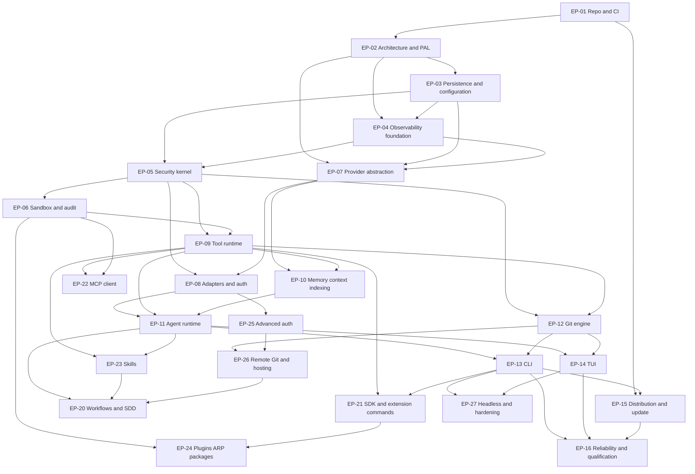

# 02 — Epics, Milestones, and Sequencing

This chapter decomposes the MVP and Beta phases of [chapter 01](01-phase-plan.md) into
epics, orders them by architectural dependency, and fixes milestones and the working
definitions of ready and done.

**Epic labels.** `EP-NN` labels are chapter-local planning labels of this volume, not
corpus identifiers — the same convention as `UC-NN` (Volume 1) and `RM-N`/`DS-*` (Volume
12). Other documents reference them by naming this volume and chapter. On the development
platform, an epic is an issue carrying the `epic` label with a task list of child issues
(Volume 11 chapter 05); the traceability validator (FR-GH-001) treats the epic as the
requirement→issue fan-out point. Every epic below therefore lists the requirement ID set
it fans out from; child issues MUST carry those IDs in their Requirements field.

**Milestone labels.** `MS-N` labels are likewise chapter-local. Each maps to a GitHub
milestone (release-scoped or phase-gate-scoped per Volume 11 chapter 05).

## MVP epics

| Epic | Name | Requirement ID set | Depends on |
|---|---|---|---|
| EP-01 | Repository, CI, and process foundations | FR-GH-002, FR-GH-003, FR-GH-004, FR-GH-005, FR-GH-006, FR-GH-007, FR-GH-009, FR-GH-012, FR-GH-001, FR-GH-008, FR-GH-010, NFR-GH-001, NFR-GH-002 | — |
| EP-02 | Architecture skeleton and PAL | FR-ARCH-001, FR-ARCH-002, FR-ARCH-003, FR-ARCH-004, FR-ARCH-005, FR-ARCH-006, FR-ARCH-011, FR-PORT-001, FR-PORT-002, FR-PORT-003, FR-PORT-004, NFR-ARCH-001, NFR-ARCH-004, NFR-PORT-002, NFR-PORT-004, FR-TEST-004 | EP-01 |
| EP-03 | Persistence and configuration | FR-CFG-001, FR-CFG-002, FR-CFG-003, FR-CFG-004, FR-CFG-005, FR-CFG-007, FR-CFG-008, FR-CFG-009, FR-CFG-010, FR-CFG-011, NFR-CFG-001, NFR-CFG-002, NFR-CFG-003, NFR-CFG-004 | EP-02 |
| EP-04 | Observability foundation | FR-OBS-001, FR-OBS-002, FR-OBS-003, FR-OBS-004, FR-OBS-005, FR-OBS-006, FR-OBS-007, FR-OBS-008, FR-OBS-009, FR-OBS-010, FR-OBS-011, FR-OBS-012, FR-OBS-013, NFR-OBS-003, NFR-OBS-006 | EP-02, EP-03 |
| EP-05 | Security kernel: permissions, approvals, secrets | FR-SEC-100, FR-SEC-103, FR-SEC-104, FR-SEC-105, FR-SEC-109, FR-SEC-110, FR-SEC-113, FR-SEC-102, NFR-SEC-004, NFR-SEC-006 | EP-03, EP-04 |
| EP-06 | Sandbox and audit | FR-SEC-101, FR-SEC-106, FR-SEC-107, FR-SEC-108, FR-SEC-111, FR-SEC-112, NFR-SEC-002, NFR-SEC-005 | EP-05 |
| EP-07 | Provider abstraction and routing | FR-PROV-001, FR-PROV-002, FR-PROV-010, FR-PROV-050, FR-PROV-011, FR-PROV-012, FR-PROV-013, FR-PROV-020, FR-PROV-021, FR-PROV-022, FR-PROV-030, FR-PROV-031, FR-PROV-040, FR-PROV-041, FR-PROV-042, FR-PROV-043, NFR-PROV-003, NFR-PROV-004 | EP-02, EP-03, EP-04 |
| EP-08 | MVP adapters and authentication | FR-AUTH-001, FR-AUTH-002, FR-AUTH-008, FR-AUTH-009, FR-AUTH-011, NFR-AUTH-001, NFR-AUTH-002, FR-PROV-080, FR-PROV-081, FR-PROV-082, FR-PROV-083, FR-PROV-084, FR-PROV-085 | EP-05, EP-07 |
| EP-09 | Tool runtime and built-in tools | FR-TOOL-001, FR-TOOL-002, FR-TOOL-003, FR-TOOL-004, FR-TOOL-005, FR-TOOL-006, FR-TOOL-007, FR-TOOL-008, NFR-TOOL-001, NFR-TOOL-002 | EP-05, EP-06 |
| EP-10 | Memory, context, and indexing | FR-MEM-001, FR-MEM-002, FR-MEM-003, FR-MEM-004, FR-MEM-005, FR-MEM-007, FR-MEM-008, FR-MEM-009, FR-MEM-010, NFR-MEM-001, NFR-MEM-002, FR-CTX-001, FR-CTX-002, FR-CTX-003, FR-CTX-004, FR-CTX-005, FR-CTX-006, FR-CTX-007, NFR-CTX-001, FR-IDX-001, FR-IDX-002, FR-IDX-003, FR-IDX-004, FR-IDX-005, FR-IDX-006, NFR-IDX-001, NFR-IDX-002 | EP-07, EP-09 |
| EP-11 | Agent runtime | FR-AGT-001, FR-AGT-002, FR-AGT-003, FR-AGT-005, FR-AGT-006, FR-AGT-007, FR-AGT-008, FR-AGT-009, FR-AGT-010, FR-AGT-011, FR-AGT-012, FR-AGT-013, FR-AGT-014, FR-AGT-015, NFR-AGT-001, NFR-AGT-002, NFR-AGT-003 | EP-08, EP-09, EP-10 |
| EP-12 | Git engine | FR-GIT-001, FR-GIT-002, FR-GIT-003, FR-GIT-004, FR-GIT-005, FR-GIT-008, NFR-GIT-001 | EP-05, EP-09 |
| EP-13 | CLI | FR-CLI-001, FR-CLI-002, FR-CLI-003, FR-CLI-005, FR-CLI-006, FR-CLI-007, FR-CLI-008, FR-CLI-009, FR-CLI-010, FR-CLI-011, FR-CLI-012, FR-CLI-013, FR-CLI-014, FR-CLI-015, FR-CLI-016, FR-UX-001, FR-UX-002, FR-UX-003, NFR-CLI-002, NFR-CLI-003, FR-ARCH-007 | EP-11, EP-12 |
| EP-14 | TUI | FR-TUI-001, FR-TUI-002, FR-TUI-003, FR-TUI-004, FR-TUI-005, FR-TUI-006, FR-TUI-007, FR-TUI-008, FR-TUI-009, FR-UX-040, FR-UX-041, FR-UX-042, FR-UX-043, FR-TUI-060, FR-TUI-061, FR-TUI-063, FR-TUI-064, FR-TUI-066, FR-TUI-067, FR-TUI-068, FR-UX-070, FR-UX-071, FR-UX-072, FR-UX-073, FR-UX-074, FR-UX-075, FR-UX-076, NFR-TUI-001, NFR-TUI-002, NFR-UX-040, NFR-TUI-069, NFR-UX-077, NFR-UX-078 | EP-11, EP-12 |
| EP-15 | Distribution and update | FR-REL-001, FR-REL-002, FR-REL-003, FR-REL-004, FR-REL-005, FR-REL-006, FR-REL-008, FR-REL-009, FR-REL-010, FR-REL-011, FR-REL-012, FR-REL-014, FR-REL-015, FR-REL-016, FR-GH-011, NFR-PORT-003 | EP-01, EP-13 |
| EP-16 | Reliability operations and MVP qualification | FR-PERF-001, FR-PERF-002, FR-PERF-003, FR-PERF-004, FR-PERF-005, FR-PERF-006, NFR-PERF-024, FR-ARCH-009, FR-ARCH-010, NFR-ARCH-003, NFR-PORT-001, FR-TEST-001, FR-TEST-002, FR-TEST-003, FR-TEST-005, FR-TEST-006, FR-TEST-007, FR-TEST-008, FR-TEST-009, NFR-TEST-001, NFR-TEST-002, NFR-TEST-003, NFR-TEST-005, NFR-TEST-006 | all MVP epics |

Notes on the mapping:

- Core-phased requirements appear inside the epic that implements them (Core is built
  first within each epic; chapter 01 keeps the phase distinction).
- FR-ARCH-007 (IPC surface) rides in EP-13 because the CLI and the IPC surface share the
  Runtime API mediation contract (FR-CLI-002); its Beta consumer is headless mode (EP-27).
- FR-GH-011 (release, upgrade, and documentation pipelines) rides in EP-15, not EP-01
  with the other FR-GH requirements: its `release.yml` is the CI realization of the
  Volume 14 release semantics that EP-15's FR-REL set builds (Volume 11 register
  delegation), and its first real run needs a releasable binary — EP-15's dependency on
  EP-01 and EP-13 supplies both the FR-GH-009/FR-GH-010 gates it consumes and the
  artifact it packages.
- FR-TOOL-007's `git.exec` catalog entry executes through the Git Engine (GitPort) that
  EP-12 builds, and EP-12 depends on EP-09 — so, as the one noted exception to the
  fan-out rule above, the `git.exec` child issue rides in EP-12's task list while
  carrying FR-TOOL-007 in its Requirements field. EP-09 exits with the remainder of the
  MVP tool subset covered; MS-4, which requires EP-09 through EP-12 to exit, verifies
  the joint behavior.
- FR-ARCH-009/FR-ARCH-010 (recovery, shutdown) are cross-cutting; EP-16 owns their
  end-to-end verification while each engine epic implements its own recovery duties.
- EP-16 is deliberately last-closing: it owns the offline suite, crash-injection
  campaigns, the benchmark suite skeleton, and the release-qualification pipeline that the
  MVP exit audit consumes. Test infrastructure itself starts in EP-01/EP-02 (contract kits
  precede adapters).

## Beta epics

| Epic | Name | Requirement ID set | Depends on |
|---|---|---|---|
| EP-20 | Workflow engine and SDD | FR-WF-001, FR-WF-002, FR-WF-003, FR-WF-004, FR-WF-005, FR-WF-006, FR-WF-007, FR-WF-008, FR-WF-009, FR-WF-010, NFR-WF-001, NFR-WF-002, NFR-WF-003, FR-AGT-004 | EP-11, EP-12 (FR-WF-007 consumes GitPort restore-point behavior), EP-23 (FR-WF-008 consumes the skill format), EP-26 (SDD change-request integration per FR-GIT-010) |
| EP-21 | Extension SDK and extension commands | FR-SDK-001, NFR-SDK-001, FR-CLI-004 | EP-09, EP-13 |
| EP-22 | MCP client | FR-MCP-001, FR-MCP-002, FR-MCP-003, FR-MCP-004, FR-MCP-005, FR-MCP-006, FR-MCP-007, FR-MCP-008 | EP-09, EP-06 |
| EP-23 | Skills | FR-SKILL-001, FR-SKILL-002, FR-SKILL-003, FR-SKILL-004, FR-SKILL-005, NFR-SKILL-001 | EP-09, EP-11 |
| EP-24 | Plugins, ARP, and package manager | FR-PLUG-001, FR-PLUG-002, FR-PLUG-003, FR-PLUG-004, FR-PLUG-005, FR-PLUG-006, FR-PLUG-007, FR-PLUG-008, FR-PLUG-009, NFR-PLUG-002, NFR-PLUG-003 | EP-06, EP-09, EP-21 |
| EP-25 | Advanced authentication | FR-AUTH-003, FR-AUTH-004, FR-AUTH-006, FR-AUTH-007, FR-AUTH-010, NFR-AUTH-003 | EP-08 |
| EP-26 | Remote Git and hosting integrations | FR-GIT-006, FR-GIT-007, FR-GIT-009, FR-GIT-010, NFR-GIT-002 | EP-12, EP-25 (hosting credentials) |
| EP-27 | Headless mode, hardening, and Beta targets | FR-ARCH-008, NFR-ARCH-002, FR-CFG-006, FR-MEM-006, FR-REL-007, FR-REL-013, FR-TUI-062, FR-TUI-065, NFR-TUI-070, NFR-CLI-001, NFR-PROV-001, NFR-OBS-001, NFR-OBS-002, NFR-OBS-005, NFR-PERF-028, NFR-TEST-004 | EP-13, EP-14, and the Beta epics it hardens |

## Dependency graph

**Prose description.** The graph has three strata. The *foundation stratum* (EP-01 through
EP-06) establishes, in order, the development platform, the layered skeleton with the 18
frozen ports and the PAL, the two databases and the configuration system, the event/log
pipeline, and the security kernel — every later epic assumes all of it. The *engine
stratum* (EP-07 through EP-12) builds the provider abstraction before any adapter
(FR-PROV-001/FR-PROV-002 precede FR-PROV-081/082/083 — the mandated
abstraction-before-adapters edge is EP-07 → EP-08), the tool runtime before every tool
consumer, and memory/context/indexing before the agent loop that assembles context. The
agent runtime (EP-11) is the convergence point: it requires working providers, tools, and
context. The *interface and delivery stratum* (EP-13 through EP-16) puts the CLI and TUI
strictly after the engines they present (the mandated engines-before-interfaces edges are
EP-11/EP-12 → EP-13/EP-14), then distribution, then the qualification epic that closes the
MVP. Beta epics hang off the engine and interface strata: the SDK precedes the plugin
ecosystem it serves; skills precede the workflow engine's skill application (FR-WF-008);
the change-request preparation flow (FR-GIT-010, EP-26) precedes the SDD stages that
integrate with it; headless mode (EP-27) closes Beta the way EP-16 closes MVP.

Constraints the graph encodes, restated as rules:

1. **PAL, persistence, and configuration before engines.** No engine epic (EP-07 through
   EP-12) starts before EP-02 and EP-03 exit. Rationale: FR-PORT-001 prohibits direct
   platform constructs, and every engine persists through the ADR-028 databases under
   FR-CFG-009 locking; building engines first would build them on surfaces that do not
   exist yet (RISK-ARCH-001).
2. **Provider abstraction before adapters.** EP-08 starts only after the ProviderPort
   behavioral contract, the Adapter Declaration (ADR-055), and the conformance kit
   (FR-TEST-004) exist. Rationale: with one adapter and no contract kit,
   provider-specific assumptions are undetectable (Volume 1's justification for the
   three-adapter seed; RISK-PROV-002).
3. **Engines before CLI/TUI.** EP-13/EP-14 present engine state; building interface
   surfaces against unfinished engines produces churn in the golden-frame and
   structured-output contracts (RISK-CLI-003, RISK-TUI-003). Thin walking-skeleton
   commands needed earlier (e.g., `version`, `config validate` for EP-03 testing) are
   allowed as EP-13 child issues delivered early — the rule binds epic exit, not first
   line of code.
4. **Security kernel before anything that acts.** EP-09 (tools), EP-08 (credentials), and
   EP-12 (git mutations) all require EP-05, because unmediated side effects are
   prohibited from the first merge (NFR-SEC-002; PRD-005).
5. **Qualification epics close phases.** EP-16 and EP-27 cannot exit before every epic
   they verify exits; they own the phase-gate evidence.

## Implementation sequence

Within the dependency graph, work proceeds in waves. Waves are planning guidance for
iteration assignment (Volume 11 Projects, two-week iterations); the graph, not the wave
numbering, is normative.

| Wave | Epics | Milestone closed |
|---|---|---|
| W1 | EP-01, EP-02 | MS-1 |
| W2 | EP-03, EP-04 | MS-1 |
| W3 | EP-05, EP-06, EP-07 | MS-2 |
| W4 | EP-08, EP-09 | MS-3 |
| W5 | EP-10, EP-12 | MS-4 |
| W6 | EP-11 | MS-4 |
| W7 | EP-13, EP-14, EP-15 | MS-5 |
| W8 | EP-16, MVP exit audit | MS-6 |
| W9 | EP-21, EP-22, EP-23, EP-25 | MS-7 |
| W10 | EP-20, EP-24, EP-26 | MS-7 |
| W11 | EP-27, Beta exit audit | MS-8 |

## Milestones

| Milestone | Name | Exit condition |
|---|---|---|
| MS-1 | Foundations complete | EP-01 through EP-04 exit: CI green with all Core gates; a binary starts on both Tier 1 operating systems, resolves configuration with attribution, opens both databases with migrations and backups, and emits enveloped events to persisted storage |
| MS-2 | Security kernel online | EP-05/EP-06 exit plus EP-07 contract surface: every permission decision path, approval, secret operation, and sandbox launch is mediated, recorded, and audit-chained; the provider conformance kit runs against a scripted fake |
| MS-3 | First model reply | EP-08 exit: a streamed chat turn completes against all three seed adapters (recorded fixtures plus a live local server), with usage accounting, normalized errors, and credentials resolved through the Secret Store |
| MS-4 | First mediated agent run | EP-09 through EP-12 exit: the agent loop plans, invokes permissioned tools inside the sandbox, assembles budgeted context, edits files, runs commands, and commits — every side effect traceable (SM-13 method) |
| MS-5 | MVP feature-complete | EP-13 through EP-15 exit: both interfaces present the full MVP surface; install and update paths work on Tier 1 platforms |
| MS-6 | MVP exit | Chapter 01 MVP exit criteria and quality gates green; T4 phase-gate audit passed; MVP release published |
| MS-7 | Beta feature-complete | EP-20 through EP-26 exit: workflows/SDD, SDK, MCP, skills, plugins, advanced auth, and hosting integrations functional with their conformance suites in CI |
| MS-8 | Beta exit / v1 candidate | Chapter 01 Beta exit criteria green: contracts frozen as release candidates, Beta-bound metrics met, upgrade/rollback to the v1 candidate tested |

## Definition of Ready

An issue (epic child) is Ready — and may enter an iteration — only when all of the
following hold. This operationalizes the Volume 11 `Ready` project status:

1. **Traceable.** The Requirements field names the corpus IDs the work realizes (or
   `process-only`); the parent epic links it in its task list.
2. **Specified.** The named requirements are lint-clean in their owning volume; no
   blocking open question in any register gates the work (a non-blocking PENDING
   VALIDATION is acceptable when the issue implements the specified abstraction, not the
   pending concrete).
3. **Bounded.** Acceptance sketch present (from the issue form); size estimated (XS–XL);
   a size of XL requires decomposition before entering an iteration.
4. **Unblocked.** All graph predecessors of the parent epic have exited, or the issue is
   explicitly marked as an allowed early walking-skeleton item (sequence rule 3).
5. **Classified.** Exactly one `type/*`, one `priority/*`, one `phase/*` label; `area/*`
   set; `security-review` applied when the change touches Volume 9-relevant paths.

## Definition of Done

An issue is Done — and its PR may merge — only when all of the following hold. This
operationalizes the Volume 11 required checks plus the corpus quality rules:

1. **Implemented and reviewed.** Human review approval per FR-GH-004 (never
   self-approved); AI provenance labeled per FR-GH-005; commit messages carry change
   information only (ADR-015).
2. **Tested.** New behavior covered at the pyramid layer its requirement's verification
   method names; coverage at or above the NFR-TEST-003 floor; no quarantined test
   introduced by the change (ADR-177 discipline).
3. **Gated.** All T0 checks green: format, lint, dependency rules (ADR-033), spec lint on
   any `docs/spec/` change, traceability validators, secret scanning.
4. **Observable.** Errors, events, and state transitions the requirement declares are
   implemented and registry-registered (FR-OBS-001 closed registry); audited actions
   write Audit Records (FR-SEC-111).
5. **Documented.** User-facing behavior lands with its user documentation and, where a
   contract changed, the schema/contract artifacts under `schemas/` with contract-diff
   evidence (NFR-ARCH-002).
6. **Recorded.** Deviations from a SHOULD, new decisions, and phase changes went through
   the change procedure (Volume 0 chapter 10) — an ADR from the appropriate block where a
   decision was made.

An **epic** is Done when every child issue is Done, the phase-appropriate portion of its
requirement ID set — the behavior those requirements phase at or before the epic's phase
— is fully covered by merged work, the suites named in those requirements' verification
methods run in CI at their designated tiers, and the epic's row in the phase-gate
evidence is green. A requirement whose content spans phases does not hold an epic open
for its later-phased portion: FR-TOOL-007's Beta/v1/v2 catalog tranches and FR-CLI-014's
reserved Beta command groups land with the epics and backlog of their own phases
([chapter 03](03-backlog-and-prioritization.md)), not inside EP-09 or EP-13. Item-level
placements recorded in the mapping notes above (the `git.exec` issue in EP-12) bind epic
coverage the same way.
